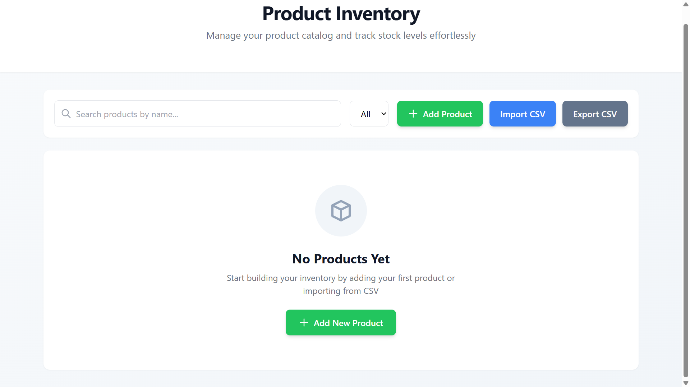
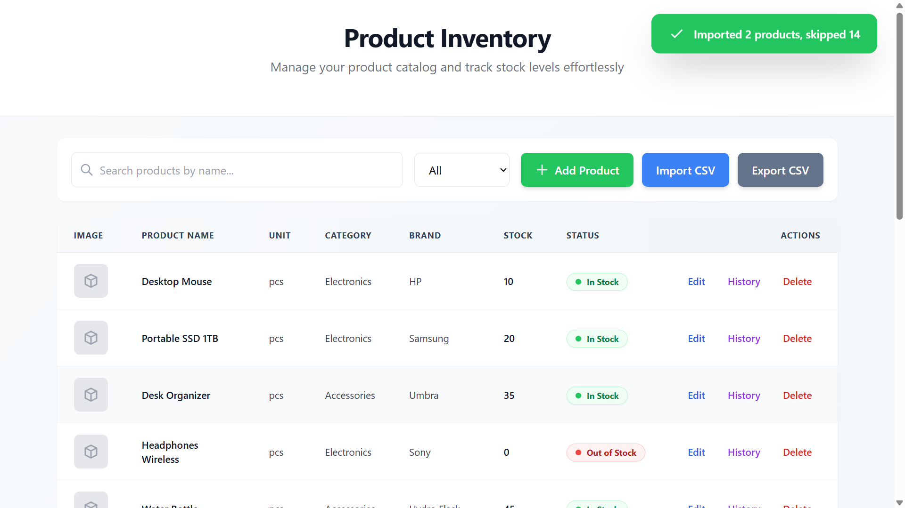
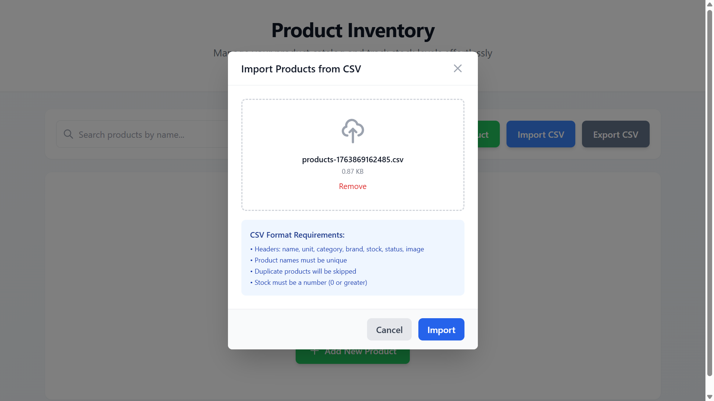
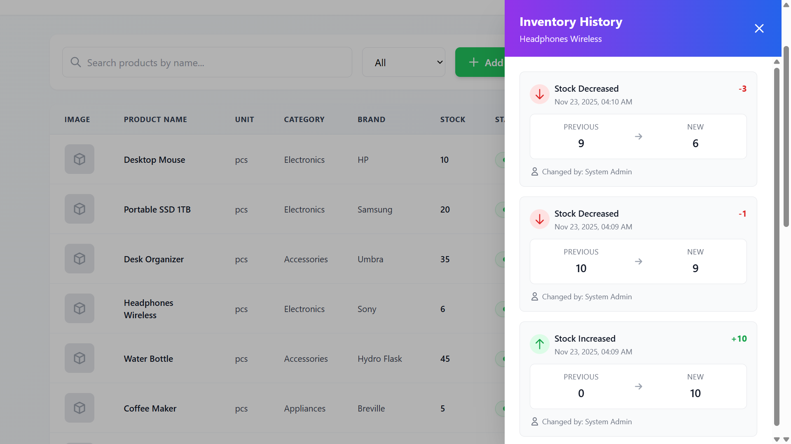

# 🚀 Product Inventory Management System

A modern, full-stack inventory management application built with **Node.js**, **Express**, **SQLite**, and **React**. This system provides comprehensive product tracking, stock management, CSV import/export, and historical inventory logging.

---

## ✨ Features

### Core Functionality
- ✅ **Product Management**: Full CRUD operations for products
- 🔍 **Advanced Search**: Real-time search by product name
- 🏷️ **Category Filtering**: Filter products by category
- 📊 **Stock Status Tracking**: Color-coded inventory levels (In Stock / Out of Stock)
- ✏️ **Inline Editing**: Edit products directly in the table
- 📜 **Inventory History**: Track all stock changes with timestamps

### Import/Export
- 📥 **CSV Import**: Bulk product import with duplicate detection
- 📤 **CSV Export**: Export entire inventory to CSV
- 🎯 **Smart Duplicate Handling**: Skip duplicate entries during import

### User Experience
- 🎨 **Modern UI**: Clean, responsive design with Tailwind CSS
- 🌈 **Color-Coded Status**: Visual stock indicators
- 📱 **Responsive Design**: Works seamlessly on all devices
- 🔔 **Toast Notifications**: Real-time feedback for all actions
- 📂 **History Sidebar**: Slide-out panel showing product changes

---

## 🏗️ Architecture

### Backend Stack
- **Runtime**: Node.js
- **Framework**: Express.js
- **Database**: SQLite3
- **File Upload**: Multer
- **Validation**: Express-validator
- **CSV Processing**: csv-parser

### Frontend Stack
- **Framework**: React 18
- **Build Tool**: Vite
- **HTTP Client**: Axios
- **Styling**: Tailwind CSS
- **Routing**: React Router DOM

### Project Structure
```
Product_Inventory_Management_System/
├── backend/
│   ├── config/
│   │   └── db.js                 # Database configuration & schema
│   ├── controllers/
│   │   └── productsController.js # Business logic
│   ├── middleware/
│   │   └── upload.js             # Multer file upload config
│   ├── routes/
│   │   └── products.js           # API route definitions
│   ├── uploads/                  # CSV upload directory
│   ├── .env                      # Environment variables
│   ├── server.js                 # Express server entry point
│   └── package.json
│
├── frontend/
│   ├── src/
│   │   ├── api/
│   │   │   └── axios.js          # API client configuration
│   │   ├── components/
│   │   │   ├── ProductTable.jsx
│   │   │   ├── ProductRow.jsx
│   │   │   ├── HistorySidebar.jsx
│   │   │   ├── ImportModal.jsx
│   │   │   └── AddProductModal.jsx
│   │   ├── pages/
│   │   │   └── ProductsPage.jsx  # Main page component
│   │   ├── App.jsx
│   │   ├── main.jsx
│   │   └── index.css
│   ├── index.html
│   ├── vite.config.js
│   ├── tailwind.config.js
│   └── package.json
│
└── README.md
```

---

## 📡 API Documentation

### Base URL
```
http://localhost:5000/api
```

### Endpoints

#### 1. Get All Products
```http
GET /products
```

**Response:**
```json
[
  {
    "id": 1,
    "name": "Wireless Mouse",
    "unit": "pcs",
    "category": "Electronics",
    "brand": "Logitech",
    "stock": 50,
    "status": "In Stock",
    "image": "https://example.com/mouse.jpg",
    "created_at": "2025-11-22T10:30:00.000Z",
    "updated_at": "2025-11-22T10:30:00.000Z"
  }
]
```

#### 2. Search Products
```http
GET /products/search?name={searchTerm}
```

**Parameters:**
- `name` (string): Search term for product name

**Response:**
```json
[
  {
    "id": 1,
    "name": "Wireless Mouse",
    ...
  }
]
```

#### 3. Create Product
```http
POST /products
Content-Type: application/json
```

**Request Body:**
```json
{
  "name": "Wireless Mouse",
  "unit": "pcs",
  "category": "Electronics",
  "brand": "Logitech",
  "stock": 50,
  "status": "In Stock",
  "image": "https://example.com/mouse.jpg"
}
```

**Response:**
```json
{
  "id": 1,
  "name": "Wireless Mouse",
  ...
}
```

#### 4. Update Product
```http
PUT /products/:id
Content-Type: application/json
```

**Request Body:**
```json
{
  "name": "Wireless Mouse Pro",
  "unit": "pcs",
  "category": "Electronics",
  "brand": "Logitech",
  "stock": 75,
  "status": "In Stock",
  "image": "https://example.com/mouse-pro.jpg"
}
```

**Response:**
```json
{
  "id": 1,
  "name": "Wireless Mouse Pro",
  ...
}
```

**Note:** If stock changes, an entry is automatically added to `inventory_history`.

#### 5. Delete Product
```http
DELETE /products/:id
```

**Response:**
```json
{
  "success": true,
  "message": "Product deleted successfully"
}
```

#### 6. Import CSV
```http
POST /products/import
Content-Type: multipart/form-data
```

**Form Data:**
- `file`: CSV file

**CSV Format:**
```csv
name,unit,category,brand,stock,status,image
Wireless Mouse,pcs,Electronics,Logitech,50,In Stock,https://example.com/mouse.jpg
Keyboard,pcs,Electronics,Dell,30,In Stock,https://example.com/keyboard.jpg
```

**Response:**
```json
{
  "success": true,
  "added": 2,
  "skipped": 0,
  "duplicates": [],
  "total": 2
}
```

#### 7. Export CSV
```http
GET /products/export
```

**Response:**
- Content-Type: `text/csv`
- Downloads CSV file with all products

#### 8. Get Product History
```http
GET /products/:id/history
```

**Response:**
```json
{
  "product": "Wireless Mouse",
  "history": [
    {
      "id": 1,
      "product_id": 1,
      "old_quantity": 50,
      "new_quantity": 75,
      "change_date": "2025-11-22T14:30:00.000Z",
      "user_info": "System Admin"
    }
  ]
}
```

---

## 🚀 Getting Started

### Prerequisites
- **Node.js** >= 16.0.0
- **npm** or **yarn**

### Installation

#### 1. Clone the Repository
```bash
git clone https://github.com/LEKKALAGANESH/inventory-management-app.git
cd inventory-management-app
```

#### 2. Setup Backend
```bash
cd backend
npm install
```

Create `.env` file:
```env
PORT=5000
NODE_ENV=development
DB_PATH=./database.sqlite
```

Start backend server:
```bash
npm run dev
```

Backend will run on `http://localhost:5000`

#### 3. Setup Frontend
```bash
cd ../frontend
npm install
```

Start frontend development server:
```bash
npm run dev
```

Frontend will run on `http://localhost:5173`

#### 4. Access Application
Open your browser and navigate to:
```
http://localhost:5173
```

---

## 🧪 Testing the Application

### Test Data CSV
Create a test CSV file (`sample-products.csv`):

```csv
name,unit,category,brand,stock,status,image
Laptop,pcs,Electronics,Dell,15,In Stock,
Desk Chair,pcs,Furniture,IKEA,25,In Stock,
Coffee Maker,pcs,Appliances,Breville,8,In Stock,
Notebook,pcs,Stationery,Moleskine,100,In Stock,
Headphones,pcs,Electronics,Sony,0,Out of Stock,
```

### Testing Steps
1. **Add Product**: Click "Add Product" button
2. **Import CSV**: Use "Import CSV" to upload test data
3. **Search**: Type product name in search bar
4. **Filter**: Select category from dropdown
5. **Edit**: Click "Edit" on any row, modify fields, and save
6. **History**: Click "History" to view stock changes
7. **Export**: Click "Export CSV" to download inventory
8. **Delete**: Click "Delete" to remove products

---

## 📦 Deployment

### Backend Deployment (Render)

1. **Create `render.yaml`** in project root:
```yaml
services:
  - type: web
    name: inventory-backend
    env: node
    buildCommand: cd backend && npm install
    startCommand: cd backend && npm start
    envVars:
      - key: NODE_ENV
        value: production
      - key: PORT
        value: 5000
```

2. **Push to GitHub**
3. **Connect to Render**
4. **Deploy** - Render will automatically deploy

### Frontend Deployment (Vercel)

1. **Install Vercel CLI**:
```bash
npm i -g vercel
```

2. **Deploy**:
```bash
cd frontend
vercel
```

3. **Update API URL** in `frontend/src/api/axios.js`:
```javascript
baseURL: import.meta.env.VITE_API_URL || 'https://your-backend.onrender.com/api'
```

4. **Set Environment Variable** in Vercel:
```
VITE_API_URL=https://your-backend.onrender.com/api
```

---

## 🔧 Environment Variables

### Backend
```env
PORT=5000
NODE_ENV=development
DB_PATH=./database.sqlite
FRONTEND_URL=http://localhost:5173
```

### Frontend
```env
VITE_API_URL=http://localhost:5000/api
```

---

## 🛠️ Development Tips

### Backend Development
```bash
# Watch mode
npm run dev

# Check logs
tail -f logs/app.log
```

### Frontend Development
```bash
# Development mode with hot reload
npm run dev

# Build for production
npm run build

# Preview production build
npm run preview
```

### Database Management
```bash
# View database
sqlite3 backend/database.sqlite

# Common queries
SELECT * FROM products;
SELECT * FROM inventory_history;
```

---

## 🐛 Troubleshooting

### Port Already in Use
```bash
# Kill process on port 5000 (backend)
npx kill-port 5000

# Kill process on port 5173 (frontend)
npx kill-port 5173
```

---

### CORS Issues
Ensure backend `.env` has correct `FRONTEND_URL`:
```env
FRONTEND_URL=http://localhost:5173
```

---

### Database Locked
```bash
# Close all connections and restart
rm backend/database.sqlite
# Restart backend - database will recreate
```

---

## 📸 Screenshots

*Add your application screenshots here after deployment*

### Dashboard


### Product List


### Import Modal


### History Sidebar


---

## 🤝 Contributing

Contributions are welcome! Please follow these steps:

1. Fork the repository
2. Create a feature branch: `git checkout -b feature/amazing-feature`
3. Commit your changes: `git commit -m 'feat: add amazing feature'`
4. Push to branch: `git push origin feature/amazing-feature`
5. Open a Pull Request

---


## 🙏 Acknowledgments

- **Express.js** - Fast, unopinionated web framework
- **React** - A JavaScript library for building user interfaces
- **SQLite** - Lightweight, serverless database
- **Tailwind CSS** - Utility-first CSS framework
- **Vite** - Next generation frontend tooling

---

## 📞 Support

For support, email galekkala5@gmail.com/lekkalagaensh14@gmail.com or open an issue on GitHub.

---

**⭐ If you find this project useful, please consider giving it a star on GitHub!**
